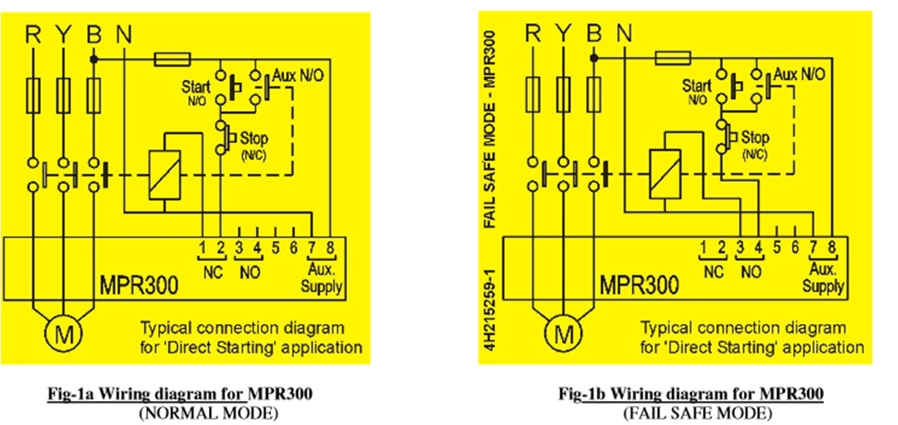

## Procedure

1. Switch ON CB for input supply
2. Press the start button.
3. Observe the induction motor is running in normal mode
4. Create single phasing fault by pressing button F1.
5. The relay tripped the motor and LED indicator glows for single phasing fault.
6. Reset the relay by pressing reset button.
7. Again start the motor and repeat the process for other faults.

## Observations 

It is observed that when any fault takes place in the Induction motor, the Numerical Relay gives a trip signal to the circuit breaker to disconnect the Induction motor supply.

# Connection Diagram of Experiment - 11

**Fig. 11.1: Circuit diagram of Numerical protection of transformer**

